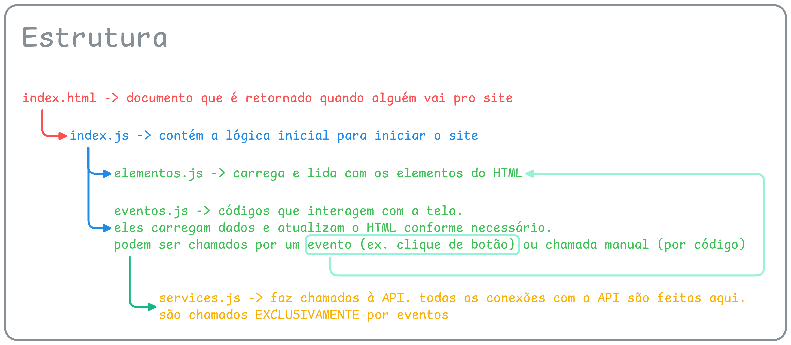
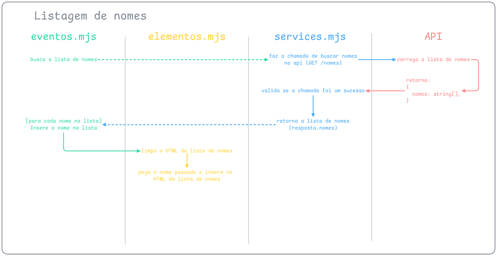

# Arthur Mini Site

Projeto simples com frontend em JavaScript modular e backend em Node/Bun + Express para listar e adicionar nomes.

## Visão geral

A aplicação possui:
- `frontend/`: interface e lógica de interação com o usuário.
- `backend/`: API responsável por fornecer e atualizar a lista de nomes.
- `assets/`: diagramas de apoio para entender a estrutura e o fluxo de execução.

## Estrutura do projeto

```text
.
├── assets/
├── backend/
└── frontend/
```

## Requisitos

- [Bun](https://bun.com/) instalado (para executar o backend)
- Navegador web moderno

## Como executar

### 1) Backend (API)

No diretório `backend/`:

```bash
bun install
bun run main.ts
```

API disponível em: `http://localhost:8000`

### 2) Frontend

Você pode servir a pasta `frontend/` com um servidor estático simples.

Exemplo com Python (na raiz do projeto):

```bash
cd frontend
python3 -m http.server 5500
```

Depois, abra no navegador:
- `http://localhost:5500`

## Endpoints principais

- `GET /nomes` retorna a lista de nomes
- `POST /nomes/adicionar/:nome` adiciona um nome na lista
- `DELETE /nomes/remover/:nome` remove um nome da lista (endpoint existente na API)

## Estrutura do frontend

A imagem abaixo resume como os módulos do frontend se organizam e se relacionam:



Resumo:
- `index.mjs` inicia a aplicação quando o DOM termina de carregar.
- `elementos.mjs` centraliza acesso e manipulação de elementos HTML.
- `eventos.mjs` orquestra ações de tela (atualizar lista, inserir nome etc.).
- `services.mjs` concentra as chamadas HTTP para a API.

## Pipeline de listagem de nomes

A listagem começa em `eventos.mjs`, passa por `services.mjs` para buscar os dados na API e volta para renderização via `elementos.mjs`.



Em termos práticos:
- o frontend chama `GET /nomes`;
- a API retorna `{ nomes: string[] }`;
- a UI limpa a lista atual e renderiza cada nome retornado.

## Pipeline de inserção de nome

A inserção começa com o valor digitado no input, segue para o serviço de API e, ao concluir, dispara novamente a listagem para refletir o novo estado.

.png)

Fluxo resumido:
- captura do nome digitado;
- envio para `POST /nomes/adicionar/:nome`;
- backend adiciona o nome e responde sucesso;
- frontend atualiza a lista para exibir o novo item.
